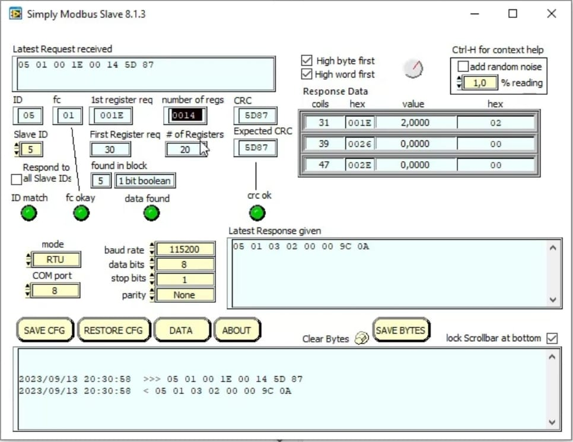

# Phase 3: STM32 Modbus RTU Implementation & Custom Drivers

This folder contains the end-to-end implementation of the **Modbus RTU** protocol over the RS485 physical layer using STM32 microcontrollers. This phase of the project focuses on developing custom drivers from the hardware level up to the application level.

*The fundamental architecture and driver development practices in this phase were created and integrated into the project under the guidance of Instructor Muhammed Fatih Köseoğlu, as part of his "STM32 Modbus Communication" course on Udemy.*

## 🏗️ Software Architecture and Custom Drivers

Instead of relying on ready-made libraries (such as standard HAL Modbus libraries), we built our own driver layer under the `Our_Drivers` directory to maintain full control over system timing and data integrity:

* **`Modbus_ex` Module:**
    * `modbus_crc16`: Hardware/software implementation of the Cyclic Redundancy Check (CRC) algorithm for error detection in Modbus packets.
    * `modbus_ex`: Core functions for parsing incoming requests and generating responses compliant with Modbus standards.
* **`Timer_ex` Module:**
    * `timer_ex`: Hardware timer configurations to manage the strict timing requirements of the Modbus RTU protocol (e.g., the 3.5-character silence period).
* **`Uart_ex` Module:**
    * `ring_buffer`: A circular buffer structure designed to prevent data loss and ensure uninterrupted asynchronous communication.
    * `uart_qrbcom`: Interrupt-based UART communication driver integrated with the ring buffer.
    * `uart_ex`: Extended functions required to operate the UART peripheral in RS485 mode (including Direction Control Pin management).

These drivers were combined within `main.c`, enabling the microcontroller to operate as a reliable node in an industrial network.

## 🔍 Testing and Validation

To analyze the accuracy of the developed system and simulate Modbus Master/Slave behaviors, **Simply Modbus Master** and **Simply Modbus Slave** software applications were utilized. 

It was verified via logic analyzers and interface programs that the developed codes successfully communicate with a standard Modbus interface, register read/write operations execute flawlessly, and CRC validations function correctly.

*Image: Byte-level analysis of incoming requests and responses sent by the STM32 via the Simply Modbus interface. (Baud rate: 115200)*

## 🚀 Conclusion

With the completion of this phase, sensor data to be added to the telemetry network (e.g., the BMP180 from previous phases) or actuators to be controlled can now be securely transmitted using the industry-standard Modbus protocol.