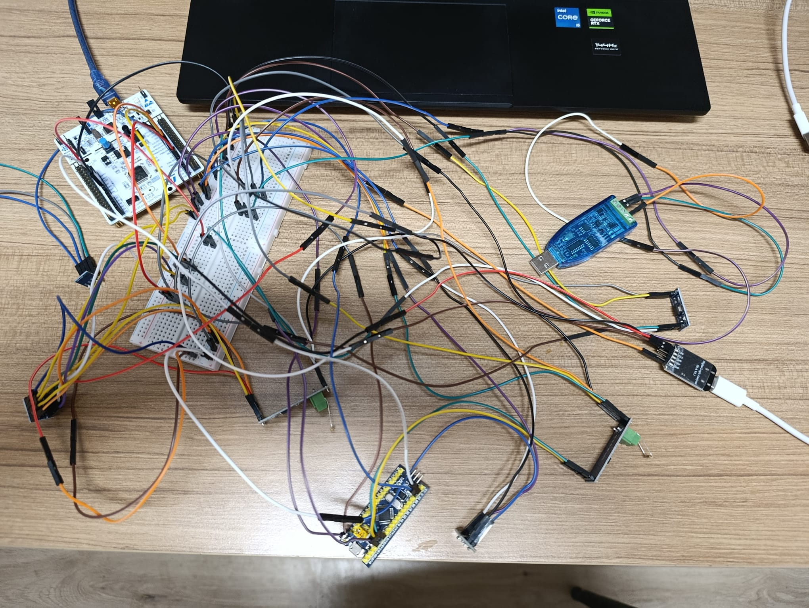
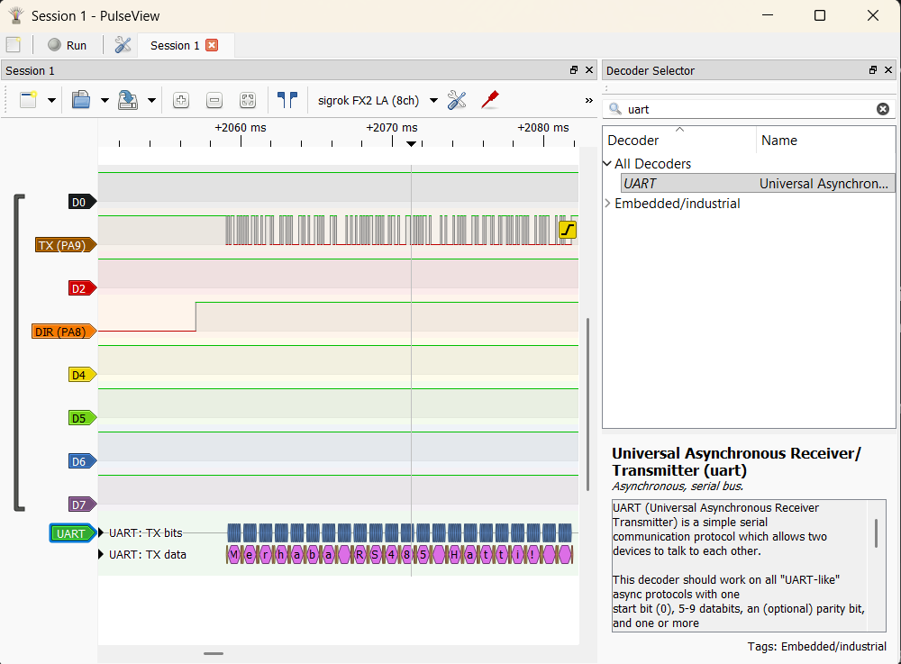
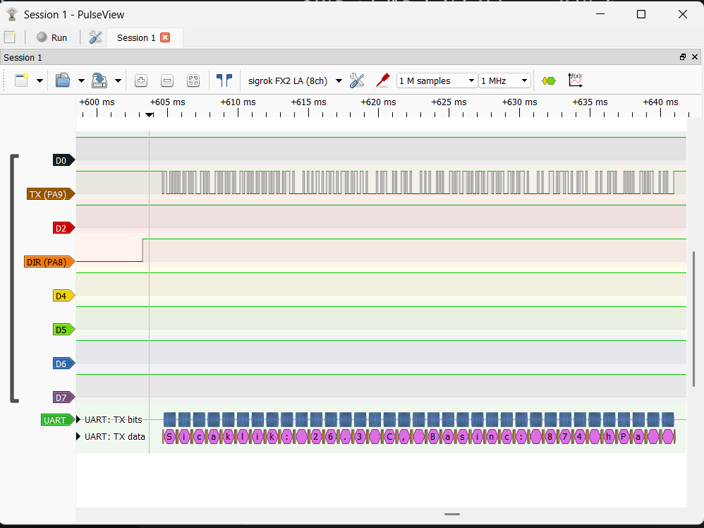

# STM32 Industrial RS485 Telemetry Network

This project demonstrates an industrial-grade Master-Slave communication network using the **RS485** protocol. It features an **STM32 Nucleo-F401RE** as the Master node collecting real-time atmospheric data via a **BMP180** sensor and broadcasting it across a differential bus to an **STM32 BluePill** node and a PC via a USB-RS485 converter.

The implementation focuses on signal integrity, power regulation, and hardware-level timing verification.

## 📸 System Hardware Setup


*Figure 1: Complete hardware implementation of the RS485 network including Master (Nucleo), Node (BluePill), and Bus Monitoring.*

---

## 🛠 Project Phases

### Phase 1: Basic RS485 Communication
- Establishment of the physical RS485 differential bus.
- GPIO-based Half-Duplex direction control (RE/DE pins).
- Initial link testing with static test messages.

### Phase 2: BMP180 Sensor Telemetry
- Integration of **BMP180** Barometric Pressure & Temperature sensor via **I2C**.
- Real-time data processing on the Master node.
- Broadcasting live sensor telemetry across the industrial bus.

---

## 🔌 Complete Wiring Diagram

```mermaid
flowchart LR

%% ================= POWER =================

NUCLEO_5V --> AMS1117_5V_IN
AMS1117_5V_OUT --> SHARED_5V

SHARED_5V --> AMS1117_3V3_IN
AMS1117_3V3_OUT --> CLEAN_3V3

SHARED_GND((COMMON_GND))

NUCLEO_GND --> SHARED_GND
BLUEPILL_GND --> SHARED_GND
RS485_TTL1_GND --> SHARED_GND
RS485_TTL2_GND --> SHARED_GND
RS485_USB_GND --> SHARED_GND
LEVEL_GND --> SHARED_GND
LOGIC_ANALYZER_GND --> SHARED_GND
AMS1117_5V_GND --> SHARED_GND
AMS1117_3V3_GND --> SHARED_GND

SHARED_5V --> RS485_TTL1_VCC
SHARED_5V --> RS485_TTL2_VCC
SHARED_5V --> LEVEL_HV
SHARED_5V --> BLUEPILL_5V

CLEAN_3V3 --> BLUEPILL_3V3
CLEAN_3V3 --> LEVEL_LV

%% ================= BMP180 =================

BMP180_GND --> NUCLEO_GND
BMP180_VIN --> NUCLEO_3V3
BMP180_SDA --> NUCLEO_PB7
BMP180_SCL --> NUCLEO_PB6

%% ================= NUCLEO + LEVEL =================

NUCLEO_D8 --> LEVEL_LV1
NUCLEO_D2 --> LEVEL_LV2
NUCLEO_D7 --> LEVEL_LV3

LEVEL_HV1 --> RS485_TTL1_DI
LEVEL_HV2 --> RS485_TTL1_RO
LEVEL_HV3 --> RS485_TTL1_DE
LEVEL_HV3 --> RS485_TTL1_RE

%% ================= BLUEPILL =================

BLUEPILL_A8 --> RS485_TTL2_DE
BLUEPILL_A8 --> RS485_TTL2_RE
BLUEPILL_A9 --> RS485_TTL2_DI
BLUEPILL_A10 --> RS485_TTL2_RO
BLUEPILL_PC13 --> STATUS_LED((STATUS_LED))

%% ================= RS485 BUS =================

RS485_TTL1_A --> BUS_A
RS485_TTL2_A --> BUS_A
RS485_USB_A --> BUS_A

RS485_TTL1_B --> BUS_B
RS485_TTL2_B --> BUS_B
RS485_USB_B --> BUS_B

BUS_A -- 120_Ohm -- BUS_B
BUS_A -- 120_Ohm -- BUS_B

%% ================= LOGIC ANALYZER =================

LOGIC_ANALYZER_CH1 --> NUCLEO_D8
LOGIC_ANALYZER_CH2 --> NUCLEO_D2
LOGIC_ANALYZER_CH3 --> NUCLEO_D7
```

---

## 🔬 Hardware Verification (Logic Analysis)

Signal integrity and UART-to-RS485 direction timing were verified using a **Logic Analyzer**.

- **Baud Rate:** 9600 bps
- **Verified Latency:** 1ms pre-transmission and 5ms post-transmission delay for stable bus switching.
- **Protocol:** Async Serial (8N1)

### Phase 1: Basic RS485 Communication
...

*Figure 2: Successful "Hello World" style test message capture during the initial link phase.*

### Phase 2: BMP180 Sensor Telemetry
...

*Figure 3: Real-time telemetry data capture showing barometric pressure and temperature readings.*

---

### ⚠️ Important Notes

- **Common Ground:** All grounds are connected to a single **COMMON GND** to prevent potential differences and communication noise.
- **Bus Wiring:** RS485 A lines and B lines are strictly connected together in a daisy-chain bus format.
- **Termination:** **120Ω termination resistors** are placed only at the two physical ends of the RS485 bus to prevent signal reflections.
- **Logic Level Conversion:** A Logic Level Converter (LLC) is utilized on the Nucleo side (**HV = 5V, LV = 3.3V**) to safely interface with 5V RS485-TTL modules.
- **Sensor Voltage:** BMP180 VIN must be connected to **3.3V** (unless the specific module includes an onboard regulator) to protect the I2C interface.

---

## 👨‍💻 About the Author
**Electrical-Electronics Engineering Candidate**
* Projects and tutorials focused on Embedded Systems
